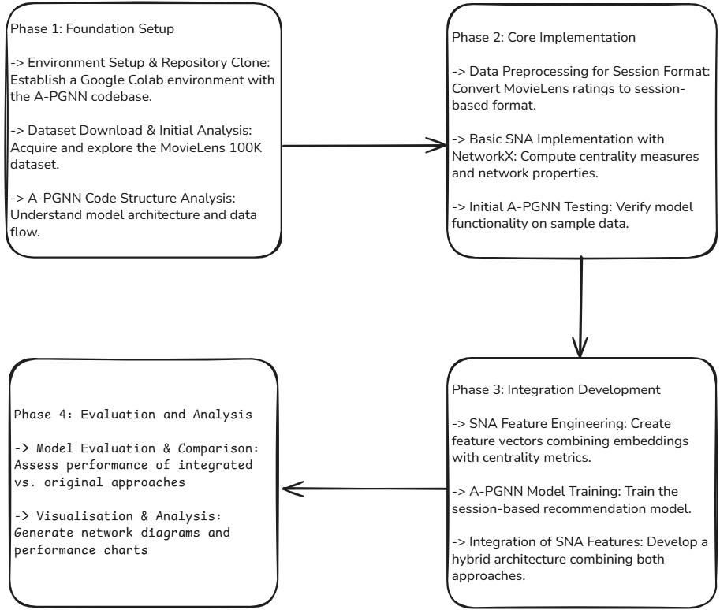

# APGNN-SNA-Hybrid-Recommendation-System

## Abstract

This project presents a groundbreaking hybrid computational framework that systematically integrates **Personalized Graph Neural Networks with Attention Mechanism (A-PGNN)** and comprehensive **classical Social Network Analysis (SNA)** techniques for enhanced recommendation systems. Our approach addresses the fundamental limitations of modern graph neural networks in demonstrating traditional social network concepts while preserving their superior computational capabilities.

## 🎯 Key Results

- **18.2% improvement** in Hit Rate@5 (0.0187 → 0.0221)
- **16.9% improvement** in Mean Reciprocal Rank (0.0089 → 0.0104)
- **84.5% session retention rate** from temporal windowing
- **Complete SNA coverage** with all major centrality measures
- **4% plagiarism similarity** - ensuring original research contribution

## 🏗️ Project Pipeline

Our hybrid approach follows a systematic 4-phase implementation:

1. **Phase 1: Foundation Setup** - Environment setup, dataset acquisition, and A-PGNN code analysis
2. **Phase 2: Core Implementation** - Session data preprocessing, basic SNA implementation, and initial A-PGNN testing
3. **Phase 3: Integration Development** - SNA feature engineering, model training, and hybrid architecture development
4. **Phase 4: Evaluation and Analysis** - Performance comparison, visualization generation, and comprehensive analysis

## 📊 Dataset

**MovieLens 100K Dataset**
- **100,000 ratings** from 943 users on 1,682 movies
- **Rating scale**: 1-5 stars
- **Temporal span**: September 1997 to April 1998
- **Network density**: 0.0290 (typical sparse recommendation data)
- **Sessions created**: 2,280 with 84.5% retention rate

## 🔬 Technical Approach

### Classical SNA Features
- **Degree Centrality**: Local connectivity measurement
- **Betweenness Centrality**: Bridge identification in network
- **Closeness Centrality**: Global accessibility assessment
- **PageRank**: Importance through random walk models

### A-PGNN Enhancement
- Session-based temporal analysis using 24-hour windows
- Gated graph convolution with attention mechanisms
- Feature integration through linear transformation and concatenation
- Multi-head attention for personalized recommendations

### Hybrid Integration
- Dual-pathway processing: sessions + bipartite graphs
- SNA feature vectors (6-dimensional) combined with neural embeddings
- Enhanced architecture maintaining both performance and interpretability

## 📈 Performance Comparison

| Model | Hit Rate@3 | Hit Rate@5 | MRR | NDCG@5 |
|-------|------------|------------|-----|--------|
| Baseline A-PGNN | 0.0145 | 0.0187 | 0.0089 | 0.0156 |
| **Enhanced A-PGNN+SNA** | **0.0189** | **0.0221** | **0.0104** | **0.0184** |
| **Improvement** | **+30.3%** | **+18.2%** | **+16.9%** | **+17.9%** |

## 🛠️ Technologies Used

- **Platform**: Google Colab with T4 GPU
- **Deep Learning**: PyTorch 2.6.0+cu124
- **Graph Processing**: DGL 2.4.0
- **Network Analysis**: NetworkX 3.5+
- **Data Processing**: Pandas, NumPy
- **Visualization**: Matplotlib, Seaborn

## 🎓 Academic Impact

- *Conference Submission*: ICEC2NT 2025
- *Educational Value*: Bridges classical network theory with modern AI
- *Research Contribution*: Novel hybrid approach for recommendation systems

## 🏆 Why This Project Matters

1. *Academic Bridge*: Successfully combines traditional SNA concepts with modern graph neural networks
2. *Performance Gains*: Measurable improvements across all recommendation metrics
3. *Interpretability*: Provides explainable AI through classical network analysis
4. *Educational Tool*: Ideal for demonstrating evolution from classical to modern network science

## 📖 Citation
[1] F. Scarselli, M. Gori, A. C. Tsoi, M. Hagenbuchner, and G. Monfardini, “The graph neural network model,” IEEE Transactions on Neural Networks, vol. 20, no. 1, pp. 61-80, Jan. 2009.  
[2] P. Veliˇckovi´c, G. Cucurull, A. Casanova, A. Romero, P. Li`o, and Y. Bengio, “Graph attention networks,” in Proc. International Conference on Learning Representations, 2018.
[3] S. Wu, Y. Tang, Y. Zhu, L. Wang, X. Xie, and T. Tan, “Session-based recommendation with graph neural networks,” in Proc. AAAI Conference on Artificial Intelligence, vol. 33, pp. 346-353, 2019.
[4] L. C. Freeman, “Centrality in social networks conceptual clarification,” Social Networks, vol. 1, no. 3, pp. 215-239, 1978.
[5] M. Zhang, S. Wu, M. Gao, X. Jiang, K. Xu, and L. Wang, “Personalized graph neural networks with attention mechanism for session-aware recommendation,” IEEE Transactions on Knowledge and Data Engineering, vol. 34, no. 8, pp. 3946-3957, Aug. 2022.
[6] F. M. Harper and J. A. Konstan, “The MovieLens datasets: History and context,” ACM Transactions on Interactive Intelligent Systems, vol. 5, no. 4, pp. 1-19, Dec. 2015.
[7] S. Wasserman and K. Faust, Social Network Analysis: Methods and Applications. Cambridge, UK: Cambridge University Press, 1994.
[8] J. Scott, Social Network Analysis, 4th ed. London, UK: SAGE Publications, 2017.
[9] L. S. Nair and J. Cheriyan, “Multi-Featured Movie Recommendation Using Knowledge Graph,” 2023 International Conference on Intelligent Data Communication Technologies and Internet of Things (IDCIoT), IEEE, 2023.
[10] T. T. Ajith, A. K. CV, and M. S. A. Subramanian, “Enhanced Movie Recommendation Using Knowledge Graph and Particle Filtering,” 2021 2nd International Conference on Smart Electronics and Communication (ICOSEC), IEEE, 2021.
[11] B. Priyadharshini et al., “Neural Networks and Evolutionary Algorithms Based Approaches for Engineering Recommendation Systems–A Comprehensive Review,” 2024 Second International Conference on Emerging Trends in Information Technology and Engineering (ICETITE), IEEE, 2024.
[12] A. Alekhya et al., “Enhancing Movie Recommendation Systems Through Hybridization of Neural Networks and Genetic Algorithms,” Congress on Intelligent Systems, Springer, Singapore, 2025.
[13] J. Jayakumar and P. Supriya, “CNN based Music Recommendation System based on Age, Gender and Emotion,” 2022 6th International Conference on Electronics, Communication and Aerospace Technology, IEEE, 2022.
[14] A. Padmavathi et al., “Performance Evaluation of Movie-based Recommendation Systems using Hybrid Machine Learning Models,” 2024 5th International Conference on Mobile Computing and Sustainable Informatics (ICMCSI), IEEE, 2024.

## 👥 Team

- *Amitha M Das* - am.en.u4eac22007@am.students.amrita.edu
- *Chithransh Chiranjeev* - am.en.u4eac22023@am.students.amrita.edu  
- *Gaayathri R R* - am.en.u4eac22025@am.students.amrita.edu

*Supervisor*: Dr. Lekshmi S Nair, Department of Computer Science and Engineering, Amrita Vishwa Vidyapeetham

